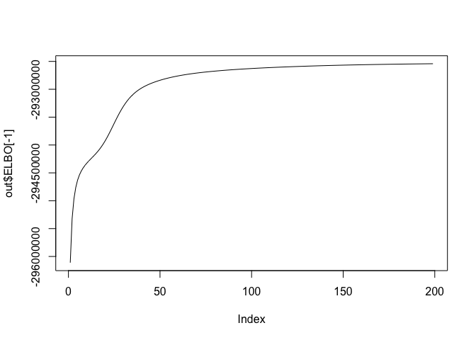
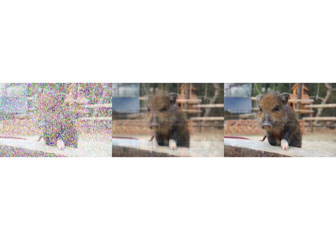

Example: missing imputation
================
Ko ABE
2024-04-03

## Setup

First, load data and package:

``` r
library(moltenNMF)
library(Matrix)
library(raster)
```

    ## Loading required package: sp

``` r
library(jpeg)

path <- paste0(system.file(package="moltenNMF"), "/data/gahag-002124.jpeg")
datraw <- readJPEG(path)
dat <- datraw[51:249,,] #trimming
plot(as.raster(dat))
```

<!-- -->

``` r
ds <- dim(dat)
N <- length(dat)
set.seed(1);ind <- sample.int(N, 0.5*N)
xall <- expand.grid(row=factor(1:ds[1]),
                    col=factor(1:ds[2]),
                    rgb=factor(1:ds[3]))

Y <- as.vector(dat)

sX <- moltenNMF::sparse_onehot(~row+col+rgb, data=xall[ind,])

out <- mNMF_vb.default(1000*Y[ind], sX,
                       L=10, offset = rep(1000, length(ind)),  iter=200)
plot(out$ELBO[-1], type="l")
```

<!-- -->

``` r
fit <- product_m(~row+col+rgb, data=xall[-ind,], out$shape/out$rate)
# plot(fit,Y[-ind],pch=".")

fit[fit>1] <- 1
fit[fit<0] <- 0
Ym <- Y
Ym[-ind] <- 1
Yimp <- Ym
Yimp[-ind] <- fit
par(mai=c(0,0,0,0), mfrow=c(1,3))
plot(as.raster(array(Ym, dim=ds)))
plot(as.raster(array(Yimp, dim=ds)))
plot(as.raster(array(Y, dim=ds)))
```

<!-- -->
