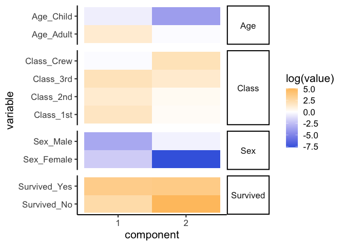

A simple example of moltenNMF
================
Ko ABE
9/13/2023

## Workflow (Titanic data)

Load packages:

``` r
if(!any(rownames(installed.packages())=="moltenNMF")){
  devtools::install_github("abikoushi/moltenNMF")
}
library(moltenNMF)
library(dplyr)
```

    ## 
    ## Attaching package: 'dplyr'

    ## The following objects are masked from 'package:stats':
    ## 
    ##     filter, lag

    ## The following objects are masked from 'package:base':
    ## 
    ##     intersect, setdiff, setequal, union

``` r
library(ggplot2)
library(tidyr)
```

Setup data,

``` r
Titanicdf <- as.data.frame(Titanic) %>% 
  mutate(Class=factor(Class,levels=c("3rd","2nd","1st","Crew")))
```

Run `mNMF_vb`,

``` r
set.seed(794)
out2 <- mNMF_vb(Freq~Survived+Class+Sex+Age, data=Titanicdf, L=2, iter=500)
```

Check convergence:

``` r
plot(out2$ELBO, type = "l", xlab="iter", ylab="ELBO")
```

<!-- -->

Check goodness-of-fit:

``` r
V <- out2$shape/out2$rate
yhat <- product_m(~Survived+Class+Sex+Age, data=Titanicdf,V)
plot(log1p(yhat), log1p(Titanicdf$Freq), ylab = "fit", xlab = "obs", xlim = c(-0.5,7), ylim=c(-0.5,7))
abline(0, 1, lty=2, col="steelblue")
```

<!-- -->

Show parameters $v_{dl}$:

``` r
Vdf <- data.frame(V,
                  variable=rownames(V),
                  facet_dummy=out2$vargroup) %>% 
  pivot_longer(!(variable|facet_dummy), names_to = "component", 
               names_transform = list(component = readr::parse_number)) %>% 
  mutate(component=factor(component))

p1 <- ggplot(Vdf, aes(y=variable, x=value, fill=component))+
  geom_col(colour="gray20")+
  facet_grid(facet_dummy~.,scales="free_y", space = "free")+
  theme_classic(16)+theme(strip.text.y = element_text(angle=0))

p2 <- ggplot(Vdf, aes(y=variable, x=value, fill=component))+
  geom_col(colour="gray20", position = "fill")+
  facet_grid(facet_dummy~.,scales="free_y",space = "free")+
  scale_x_continuous(labels=scales::percent)+
  theme_classic(16)+theme(strip.text.y = element_text(angle=0))

p3 <- ggplot(Vdf, aes(y=variable, x=component, fill=log(value)))+
  geom_tile()+
  facet_grid(facet_dummy~.,scales="free_y",space = "free")+
  scale_fill_gradient2(low="royalblue", high="orange", mid="white", midpoint=0)+
  theme_classic(16)+theme(strip.text.y = element_text(angle=0))

print(p1)
```

<!-- -->

``` r
print(p2)
```

<!-- -->

``` r
print(p3)
```

<!-- -->

These plot show co-occurrence relationships between variables. You can
see that many of survivors of Titanic are women, because of
`Survived_Yes` and `Sex_Female` have large proportion `component 1`.

``` r
V <- out2$shape/out2$rate
simmilar_top_n(log(V),ref = log(grepV(V,"Survived_No")))
```

    ##                      X1         X2       dist
    ## Survived_No   2.4968956  5.0979919   0.000000
    ## Survived_Yes  3.4813868  3.5754540   3.287344
    ## Class_3rd     1.9808004  1.4289654  13.728110
    ## Class_Crew   -0.1446455  2.0367264  16.349085
    ## Class_2nd     1.3371932  0.3570788  23.821167
    ## Class_1st     1.7168385  0.2358003  24.249396
    ## Age_Adult     1.3125283 -0.1323644  28.759353
    ## Sex_Male     -3.4187368 -0.4709240  66.007531
    ## Age_Child    -0.6392318 -3.8621590  90.119598
    ## Sex_Female   -1.9534643 -7.7022485 183.651856

``` r
V <- V/rowSums(V)
simmilar_top_n(log(V),ref = log(grepV(V,"Survived_No")))
```

    ##                        X1          X2       dist
    ## Survived_No  -2.672665203 -0.07156894  0.0000000
    ## Sex_Male     -2.998937683 -0.05112487  0.1068717
    ## Class_Crew   -2.288329085 -0.10695714  0.1489666
    ## Survived_Yes -0.741286459 -0.64721925  4.0615971
    ## Class_3rd    -0.454821515 -1.00665650  5.7932194
    ## Class_2nd    -0.318648738 -1.29876315  7.0473992
    ## Age_Adult    -0.211695365 -1.65658809  8.5686582
    ## Class_1st    -0.204899313 -1.68593752  8.6960544
    ## Age_Child    -0.039065193 -3.26199244 17.1146511
    ## Sex_Female   -0.003181586 -5.75196580 39.3930513
