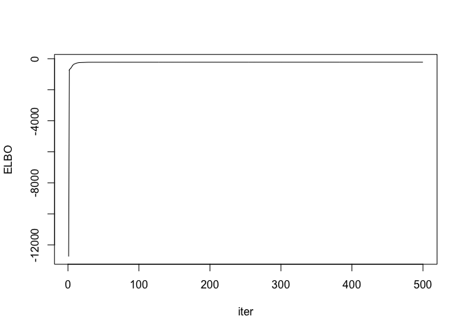
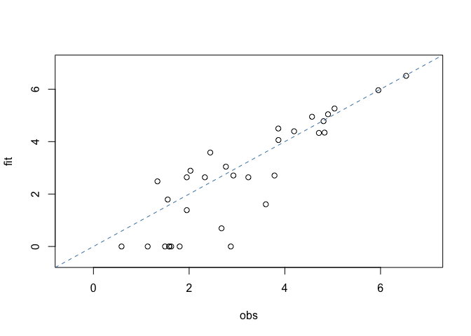

A simple example of moltenNMF
================
Ko ABE
9/13/2023

## Workflow (Titanic data)

Load packages:

``` r
if(!any(rownames(installed.packages())=="moltenNMF")){
  devtools::install_github("abikoushi/moltenNMF")
}
library(moltenNMF)
library(dplyr)
```

    ## 
    ## Attaching package: 'dplyr'

    ## The following objects are masked from 'package:stats':
    ## 
    ##     filter, lag

    ## The following objects are masked from 'package:base':
    ## 
    ##     intersect, setdiff, setequal, union

``` r
library(ggplot2)
library(tidyr)
```

Run `mNMF_vb`:

``` r
Titanicdf <- as.data.frame(Titanic) %>% 
  mutate(Class=factor(Class,levels=c("3rd","2nd","1st","Crew")))

set.seed(794)
out2 <- mNMF_vb(Freq~Survived+Class+Sex+Age, data=Titanicdf, L=2, iter=500)
```

Check convergence:

``` r
quickplot(1:length(out2$ELBO),out2$ELBO, geom = "line")+
  labs(x="iter",y="ELBO")+
  theme_minimal(16)
```

    ## Warning: `qplot()` was deprecated in ggplot2 3.4.0.
    ## This warning is displayed once every 8 hours.
    ## Call `lifecycle::last_lifecycle_warnings()` to see where this warning was
    ## generated.

<!-- -->

Check goodness-of-fit:

``` r
V <- out2$shape/out2$rate
yhat <- product_m(~Survived+Class+Sex+Age, data=Titanicdf,V)
qplot(yhat, Titanicdf$Freq, alpha=I(0.5),size=I(3))+
  labs(x="fit",y="obs")+
  geom_abline(intercept=0,slope=1,linetype=2)+
  theme_minimal(16)
```

<!-- -->

Show parameters $v_{dl}$:

``` r
Vdf <- data.frame(V,
                  variable=rownames(V),
                  facet_dummy=out2$vargroup) %>% 
  pivot_longer(!(variable|facet_dummy), names_to = "component", 
               names_transform = list(component = readr::parse_number)) %>% 
  mutate(component=factor(component))

p1 <- ggplot(Vdf, aes(y=variable, x=value, fill=component))+
  geom_col(colour="gray20")+
  facet_grid(facet_dummy~.,scales="free_y", space = "free")+
  theme_classic(16)+theme(strip.text.y = element_text(angle=0))

p2 <- ggplot(Vdf, aes(y=variable, x=value, fill=component))+
  geom_col(colour="gray20", position = "fill")+
  facet_grid(facet_dummy~.,scales="free_y",space = "free")+
  scale_x_continuous(labels=scales::percent)+
  theme_classic(16)+theme(strip.text.y = element_text(angle=0))

print(p1)
```

<!-- -->

``` r
print(p2)
```

<!-- -->

These plot show co-occurrence relationships between variables. You can
see that many of survivors of Titanic are women, because of
`Survived_Yes` and `Sex_Female` have large proportion `component 1`.
